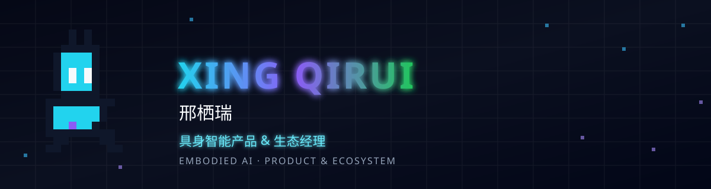

  

### 👋 关于我

- 🏫 **重庆大学** · 机器人工程（明月创新班）· 本科
- 🎓 **香港大学** · 人工智能（Artificial Intelligence）· 硕士
- 🤖 **智元机器人** · 具身智能生态发展经理

专注 **具身智能产品与生态**：开发者社区建设、开源生态体系搭建、机器人赛事运营与产品解决方案落地。

---

### 🎓 教育经历

| 时间 | 学校 | 专业 |
| :---: | :--- | :--- |
| 2026 — 2027 | 香港大学 | 人工智能（Artificial Intelligence）· 硕士 |
| 2021 — 2025 | 重庆大学 · 国家卓越工程师学院 | 机器人工程（明月创新班）· 本科 |

### 🤖 工作经历

| 时间 | 公司 | 职位 |
| :---: | :--- | :--- |
| 2026.02 — 2026.09 | 上海智元机器人 | 具身智能生态发展经理 |

### 🛠️ 技术栈

`C++` `Python` `ROS` `SolidWorks` `Isaac Sim` `MuJoCo` · `生态运营` `开发者社区` `产品设计`

### 🏆 荣誉

- 🥇 中国大学生 ICAN 创新创业大赛 · 国金
- 🥈 中国大学生「互联网+」大赛 · 重庆市金奖
- 🥈 全国智能车竞赛 ROS 机器人 · 二等奖
- 💡 第一发明人专利 2 项

---

  EMBODIED AI · PRODUCT &amp; ECOSYSTEM

